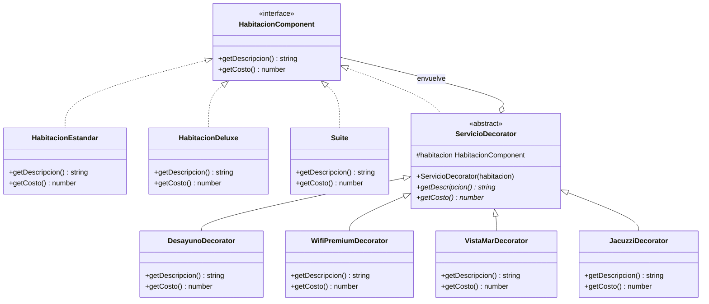
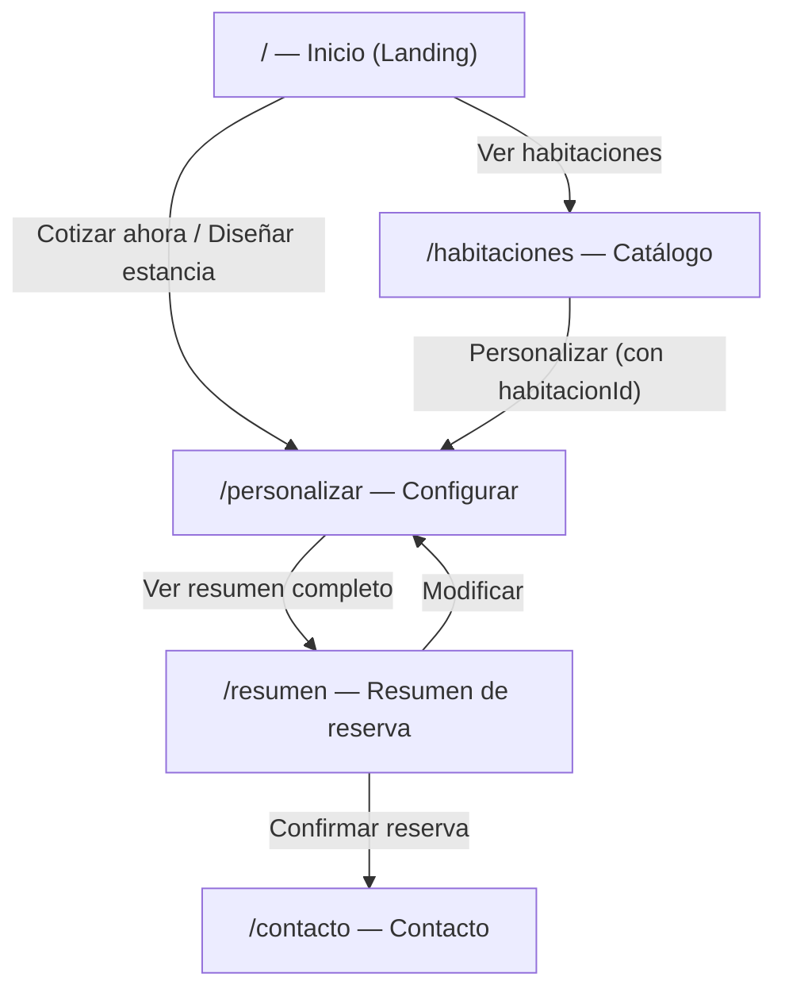
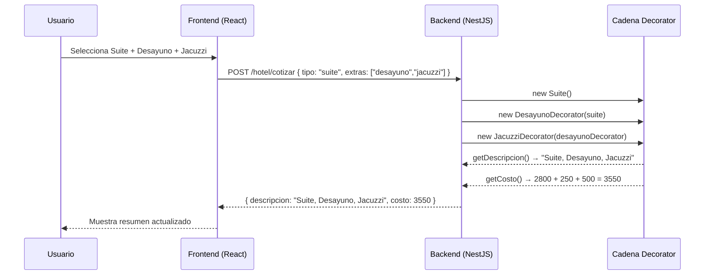

# Aurum Grand Hotel — Patrón Decorator

Sistema web completo de reservación hotelera que aplica el **patrón de diseño Decorator** de forma real.  
**Stack:** NestJS · TypeScript · React · Vite · Tailwind CSS

---

## Descripción general

El sistema permite al usuario seleccionar una habitación base (Estándar, Deluxe o Suite) y agregar servicios adicionales (Desayuno, WiFi Premium, Vista al Mar, Jacuzzi). Cada combinación es procesada por el backend usando el patrón Decorator, que acumula el costo y la descripción de forma dinámica sin modificar las clases base.

---

## Estructura del proyecto

```
patrondecorator/
├── backend/
│   ├── api/
│   │   └── index.ts                  ← Adaptador serverless para Vercel
│   ├── src/
│   │   ├── hotel/
│   │   │   ├── componentes/
│   │   │   │   ├── habitacion.component.ts     ← Interfaz base (Component)
│   │   │   │   ├── habitacion-estandar.ts      ← Componente concreto
│   │   │   │   ├── habitacion-deluxe.ts        ← Componente concreto
│   │   │   │   └── suite.ts                    ← Componente concreto
│   │   │   ├── decoradores/
│   │   │   │   ├── servicio.decorator.ts       ← Decorador abstracto
│   │   │   │   ├── desayuno.decorator.ts       ← Decorador concreto
│   │   │   │   ├── wifi-premium.decorator.ts   ← Decorador concreto
│   │   │   │   ├── vista-mar.decorator.ts      ← Decorador concreto
│   │   │   │   └── jacuzzi.decorator.ts        ← Decorador concreto
│   │   │   ├── dto/
│   │   │   │   └── cotizar-habitacion.dto.ts   ← DTO con validaciones
│   │   │   ├── hotel.controller.ts
│   │   │   ├── hotel.service.ts
│   │   │   └── hotel.module.ts
│   │   ├── app.module.ts
│   │   └── main.ts
│   ├── package.json
│   ├── tsconfig.json
│   ├── nest-cli.json
│   ├── vercel.json
│   └── .env.example
│
└── frontend/
    ├── src/
    │   ├── components/
    │   │   ├── Navbar.tsx
    │   │   ├── Hero.tsx
    │   │   ├── HabitacionesDestacadas.tsx
    │   │   ├── SelectorExtras.tsx
    │   │   ├── ResumenReserva.tsx
    │   │   └── Footer.tsx
    │   ├── pages/
    │   │   ├── Inicio.tsx
    │   │   ├── Habitaciones.tsx
    │   │   ├── PersonalizarHabitacion.tsx
    │   │   ├── Resumen.tsx
    │   │   └── Contacto.tsx
    │   ├── services/
    │   │   └── hotelApi.ts
    │   ├── types/
    │   │   └── hotel.ts
    │   ├── App.tsx
    │   ├── main.tsx
    │   └── index.css
    ├── index.html
    ├── package.json
    ├── vite.config.ts
    ├── tailwind.config.js
    ├── vercel.json
    └── .env.example
```

---

## Instalación y ejecución local

### Backend

```bash
cd backend
npm install
cp .env.example .env
npm run start:dev        # http://localhost:3000
```

### Frontend

```bash
cd frontend
npm install
cp .env.example .env     # Ajustar VITE_API_URL si es necesario
npm run dev              # http://localhost:5173
```

---

## Endpoints REST

| Método | Ruta                   | Descripción                              |
|--------|------------------------|------------------------------------------|
| GET    | `/hotel/habitaciones`  | Lista de habitaciones base con metadatos |
| GET    | `/hotel/extras`        | Lista de servicios adicionales           |
| POST   | `/hotel/cotizar`       | Aplica Decorator y devuelve resultado    |

### Ejemplo `POST /hotel/cotizar`

**Request:**
```json
{
  "tipo": "estandar",
  "extras": ["desayuno", "wifi", "vista_mar"]
}
```

**Response:**
```json
{
  "tipo": "estandar",
  "extras": ["desayuno", "wifi", "vista_mar"],
  "descripcion": "Habitación Estándar, Desayuno, WiFi Premium, Vista al Mar",
  "costo": 1920
}
```

**Desglose del costo:**
- Habitación Estándar: $1,200
- + Desayuno: $250
- + WiFi Premium: $120
- + Vista al Mar: $350
- **Total: $1,920**

---

## Precios

| Habitación          | Base     |
|---------------------|----------|
| Estándar            | $1,200   |
| Deluxe              | $1,800   |
| Suite               | $2,800   |

| Extra               | Precio   |
|---------------------|----------|
| Desayuno            | +$250    |
| WiFi Premium        | +$120    |
| Vista al Mar        | +$350    |
| Jacuzzi             | +$500    |

---

## Diagramas Mermaid

### Diagrama UML — Patrón Decorator



### Mapa de páginas — Frontend



### Flujo de datos — Patrón Decorator en acción



---

## Despliegue en Vercel

### Frontend (recomendado — directo en Vercel)

1. Conecta el repositorio en [vercel.com](https://vercel.com)
2. Configura el proyecto:
   - **Root Directory:** `frontend`
   - **Build Command:** `npm run build`
   - **Output Directory:** `dist`
3. Agrega variable de entorno:
   - `VITE_API_URL` → URL del backend desplegado
4. El archivo `frontend/vercel.json` ya incluye los rewrites para SPA routing.

### Backend — Opciones de despliegue

#### Opción A: Vercel (serverless, incluido en este repo)

El archivo `backend/vercel.json` configura `api/index.ts` como función serverless.

```bash
cd backend
vercel --prod
```

- Vercel ejecuta `api/index.ts` como Lambda
- NestJS se inicializa una vez y se cachea en el contenedor
- **Limitación:** cold starts en el primer request; no apto para WebSockets

#### Opción B: Railway (recomendado para producción)

```bash
# En Railway, configura:
# Root Directory: backend
# Build Command: npm run build
# Start Command: npm run start:prod
# Puerto: 3000 (Railway lo expone automáticamente)
```

#### Opción C: Render

```bash
# Build Command: npm install && npm run build
# Start Command: npm run start:prod
```

### Variables de entorno en producción

**Backend:**
```
PORT=3000
FRONTEND_URL=https://tu-frontend.vercel.app
```

**Frontend:**
```
VITE_API_URL=https://tu-backend.railway.app
```

---

## Por qué este proyecto aplica Decorator correctamente

El patrón Decorator está correctamente implementado porque:

1. **Misma interfaz:** `HabitacionEstandar`, `HabitacionDeluxe`, `Suite` y todos los decoradores implementan `HabitacionComponent`. Son intercambiables.

2. **Sin modificar clases base:** `HabitacionEstandar` nunca sabe que está siendo decorada. Su código no cambia.

3. **Composición dinámica en runtime:** La cadena se construye en `hotel.service.ts` según el request:
   ```typescript
   let habitacion = new HabitacionEstandar();              // base
   habitacion = new DesayunoDecorator(habitacion);          // +$250
   habitacion = new WifiPremiumDecorator(habitacion);       // +$120
   // habitacion.getCosto() → 1570  (sin modificar ninguna clase)
   ```

4. **Delegación en cadena:** Cada decorador llama a `this.habitacion.getCosto()` antes de sumar su propio valor, formando una cadena recursiva.

5. **Extensible sin tocar código existente:** Para agregar "Servicio de spa" solo se crea `SpaDecorator extends ServicioDecorator` — nada más cambia.

---

## Autor

Jordi Ortega — Proyecto académico · Patrón de diseño Decorator
